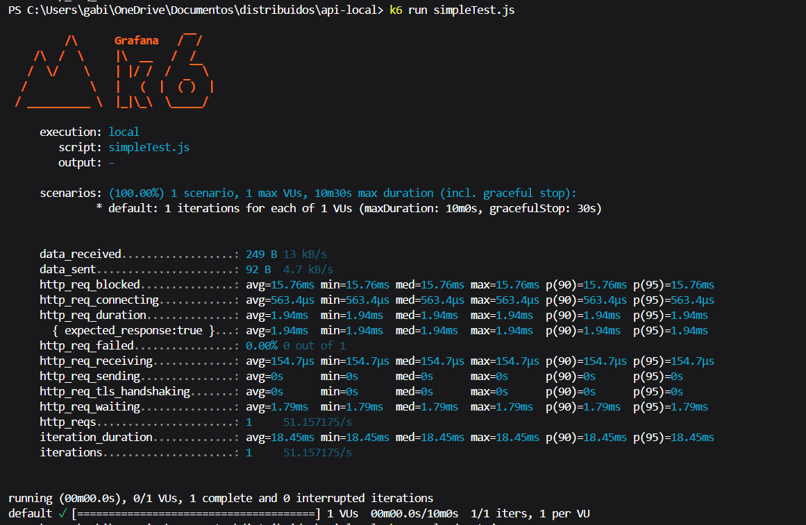
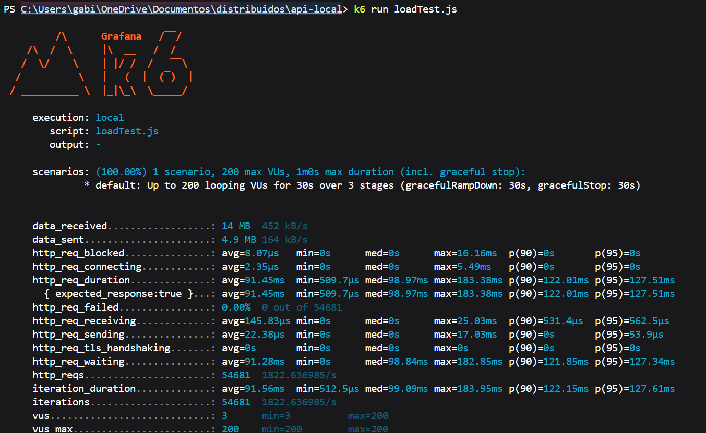
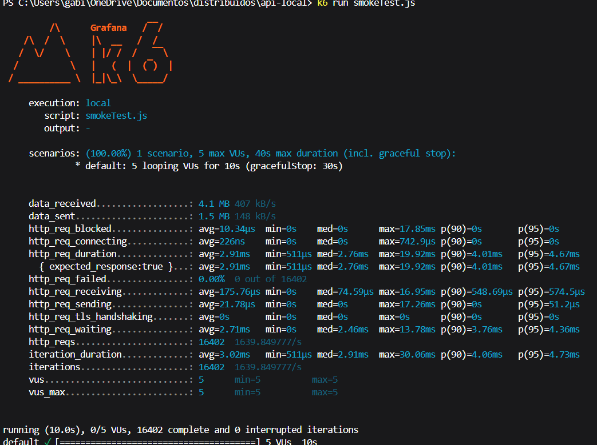

### TESTE DE CARGA

# SIMPLE TEST(SIMPLES)

A Primeira imagem mostra os resultados de um teste mais simples, também realizado com o k6. Nesse caso, o script utilizado foi o simpleTest.js, e a configuração do cenário especificou apenas um usuário virtual (VU), que realizou uma única iteração. A duração máxima permitida para o teste era de 10 minutos e 30 segundos, mas ele foi concluído rapidamente devido à natureza básica do cenário.
Os resultados apontam que, nesse teste, foram recebidos apenas 249 bytes de dados, com uma taxa média de 13 KB/s, enquanto 92 bytes foram enviados, com uma média de 4,7 KB/s. O tempo total de duração da requisição HTTP (http_req_duration) foi de apenas 1,94 ms, e como só houve uma única requisição, os valores de média, mediana, mínimo e máximo são idênticos. Outros tempos relevantes incluem o de conexão com o servidor (http_req_connecting), que foi de 563,4 µs, e o de espera pela resposta do servidor (http_req_waiting), que foi de 1,79 ms. Nenhuma falha foi registrada, e o tempo total da execução foi de 18,45 ms.
Esse tipo de teste é muito básico e serve principalmente para verificar se o sistema responde corretamente a uma única requisição, sendo ideal para validar a configuração do ambiente antes de iniciar testes mais complexos, como o que foi apresentado na primeira imagem.

# LOAD TEST(CARGA)

A Segunda imagem apresenta os resultados de um teste de carga realizado com a ferramenta k6, que é amplamente utilizada para avaliar o desempenho de sistemas, como APIs. Nesse teste, o script utilizado foi o loadTest.js, e a execução aconteceu localmente. O cenário configurado específica que até 200 usuários virtuais (VUs) foram simulados simultaneamente, com uma duração máxima de 1 minuto, incluindo o tempo para iniciar e parar o teste de maneira suave. O teste foi dividido em três estágios: nos primeiros 30 segundos, a carga foi aumentada progressivamente até atingir os 200 usuários; nos próximos 30 segundos, manteve-se os 200 usuários ativos; e, ao final, houve uma desaceleração suave para encerrar o teste.
Os resultados exibem algumas métricas principais. Por exemplo, o total de dados recebidos foi de 14 MB, com uma taxa média de 452 KB/s, enquanto os dados enviados totalizaram 4,9 MB, com média de 164 KB/s. A métrica mais importante, o tempo de duração das requisições HTTP (http_req_duration), apresentou uma média de 91,45 ms, com a mediana em 98,97 ms, e o percentil 90 indicando que 90% das requisições foram concluídas em até 122,01 ms. Felizmente, nenhuma requisição falhou durante o teste, o que demonstra estabilidade no sistema testado. No total, foram realizadas 54.681 requisições, com um tempo médio de execução de cada ciclo sendo 91,56 ms.
Esse teste permite verificar a resiliência e o comportamento do sistema sob uma carga alta, garantindo que ele consegue lidar com muitos usuários simultâneos sem apresentar problemas de desempenho.

# SMOKE TEST(FUMAÇA)

A imagem mostra a execução de um teste de carga utilizando o K6, que é uma ferramenta de testes de performance para aplicações web e APIs. Nesse caso, está sendo rodado o script chamado smokeTest.js, configurado para testar um cenário específico com até 5 usuários virtuais (VU, ou "Virtual Users") simultâneos, durante um período máximo de 40 segundos (incluindo a parada "graceful" de 30 segundos).
O teste foi configurado para que 5 usuários virtuais executem loops por 10 segundos. Durante a execução, várias métricas importantes foram coletadas e exibidas no console, como dados enviados e recebidos, tempo de conexão, duração total das requisições, e se as respostas retornadas foram bem-sucedidas ou não.
Os resultados indicam que 16.402 requisições HTTP foram realizadas no período do teste, com nenhuma falha (0%). A duração média de cada requisição (http_req_duration) foi de 2,91ms, e o tempo de espera (http_req_waiting) também foi baixo, com média de 2,71ms. Esses números indicam que o sistema conseguiu responder rapidamente a todas as requisições. Além disso, o relatório mostra o tempo médio gasto em atividades específicas, como conectar ao servidor (http_req_connecting), enviar dados (http_req_sending), e receber a resposta (http_req_receiving).
No final do teste, foi exibido um resumo detalhado das estatísticas, como os tempos médios, mínimos e máximos de resposta, e percentis importantes (como p(90) e p(95), que mostram o tempo abaixo do qual 90% e 95% das requisições foram concluídas, respectivamente). No geral, o sistema parece estar funcionando bem sob a carga configurada, com boa performance e sem erros.

