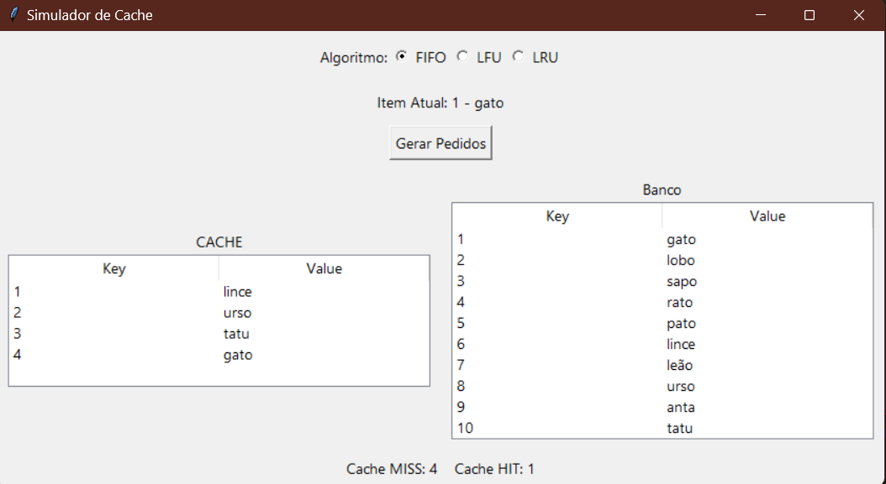

## Objetivo

Criamos uma simulação gráfica de cache que permite testar os algoritmos de substituição de cache FIFO, LRU e LFU, utilizando Tkinter para construir a interface gráfica.

Componentes Principais do Código:

# Banco de Dados (BD):

Representado por uma tabela de 10 itens (Key e Value), com valores como "gato", "lobo", etc.
Cache:

Uma tabela com 5 posições para armazenar os dados carregados do banco.
Segue a política de substituição escolhida.
Políticas de Substituição:

- FIFO: Remove o dado mais antigo da cache.
- LRU: Remove o dado menos recentemente usado.
- LFU: Remove o dado menos frequentemente acessado.

# Estatísticas:

- Cache HIT: Contador que incrementa quando o dado já está na cache.
- Cache MISS: Contador que incrementa quando o dado precisa ser carregado do banco.
- Interface Gráfica (GUI):

Botões de rádio: Selecionar o algoritmo de substituição (FIFO, LFU, LRU).

# Tabelas:

Uma tabela para exibir o banco de dados.
Outra tabela para mostrar o estado atual da cache.
Botão "Gerar Pedidos": Simula o acesso a um item aleatório do banco.
Exibição de estatísticas (HIT/MISS) e o item atual requisitado.

## Fluxo de Funcionamento
Inicialização:

O banco de dados é preenchido com 10 itens fixos.
A cache começa vazia.
Interação do Usuário:

O usuário escolhe o algoritmo de substituição usando os botões de rádio.
O botão "Gerar Pedidos" seleciona um item aleatório do banco para acesso.

# Lógica de Cache:

Se o item requisitado já estiver na cache (HIT), ele é identificado como tal.
Se não estiver (MISS), o item é carregado do banco para a cache, substituindo outro item caso a cache esteja cheia (de acordo com o algoritmo escolhido).

# Atualização da Interface:

A cache e as estatísticas são atualizadas automaticamente após cada requisição.

# Resultado
O programa oferece uma maneira interativa de visualizar como os algoritmos de substituição de cache funcionam, mostrando claramente os impactos de cada política (FIFO, LFU, LRU) e permitindo entender conceitos de Cache HIT e Cache MISS de forma prática.

